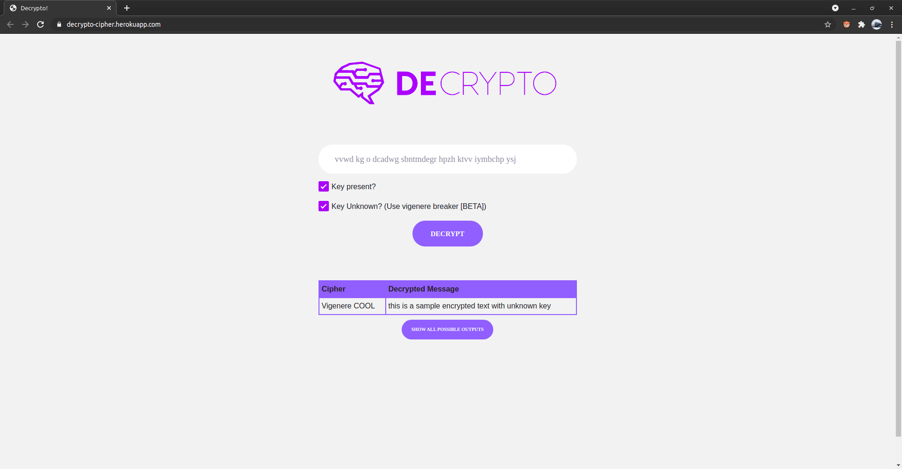

# Decrypto


## Introduction
Decrypto is a simple python based application to decrypt popular ciphers for users finding it difficult to analyse them.
It uses multiple ciphers to decrypt an encrypted text and then look for English words to filter.

Deployed at [decrypto-cipher.herokuapp.com](https://decrypto-cipher.herokuapp.com/)

Currently the app is capable of solving 10+ most common ciphers. More to be implemented soon!

- Alphabets Only
    - Atbash
    - ROT Shifts (1 to 26)
    - RailFence (3 to 5)
- Alphanumeric 
    - Base16, Base36, Base64
    - ASCII Shift (1 to 255)
- Numeric 
    - T9 cipher
    - DTMF
    - Binary to ASCII
    - Periodic table atomic number to symbols
    - Prime Indexing
    - A1Z26
- Alphabetic Keyed
    - Vigenere

Apart from them, a method to decrypt Vigenere cipher without a key is also implemented. It performs dictionary attack on 
the keys and detect English words. 

## Requirements

```sh
pip install -r requirements.txt
```

## Installation

```sh
python app.py
```


## Examples



  

## LICENSE

[MIT LICENSE](http://www.tldrlegal.com/license/mit-license)

